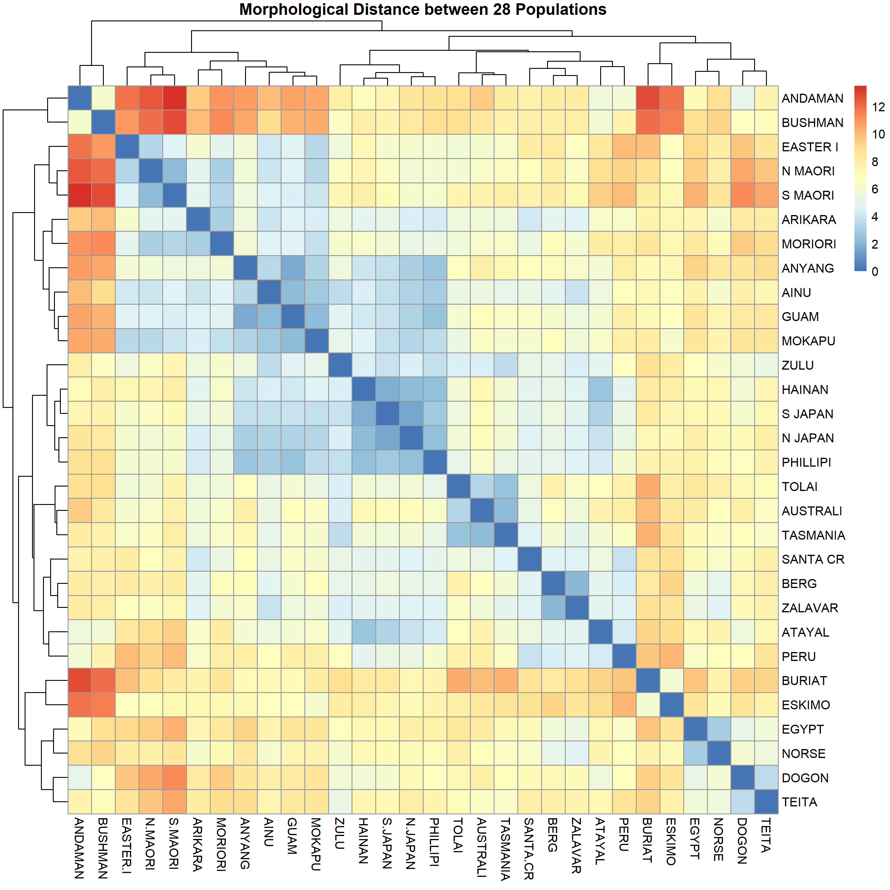
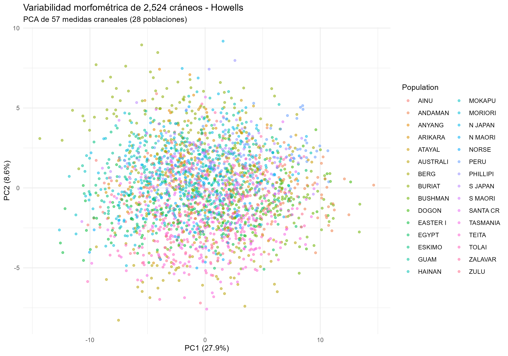
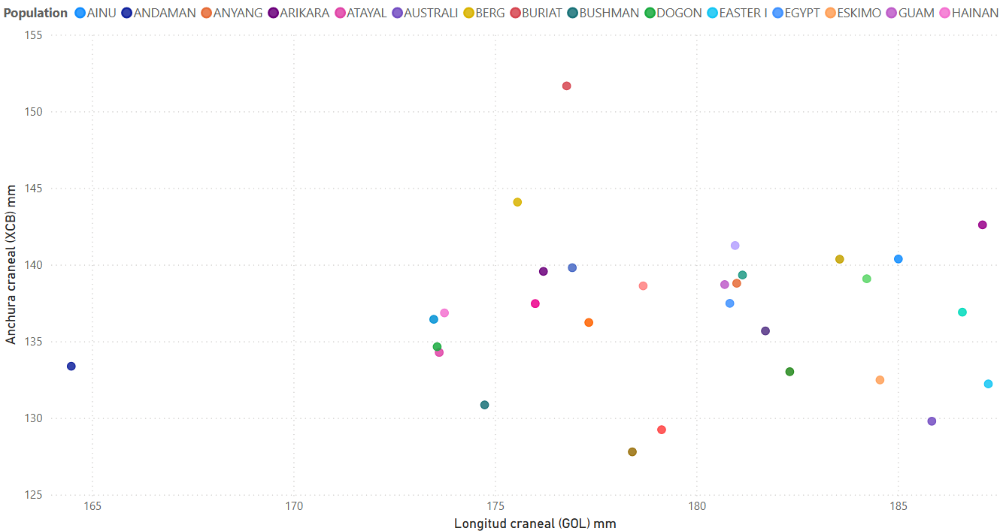

# Howells Cranio-Genomic Distance: Quantifying Human Population Structure from 2,524 Skulls

Multivariate morphometric analysis testing whether cranial shape variation across 28 worldwide populations reflects geographic isolation and population history.

<p align="left">


</p>

---

## TL;DR

Does skull shape carry a signature of geographic isolation? Using the Howells craniometric dataset (2,524 individuals, 28 populations, 57 measurements), this project computes population-level morphological distances and tests them against clustering and dimensionality-reduction methods. The answer is yes: geographically and historically isolated populations — Andaman Islanders, San (Bushman), Buriat, and Arctic Eskimo — separate from the global sample at distances exceeding 12 standard units, consistent with genetic drift and founder effects operating on small, isolated founding populations.

---

## Key Metrics

| Metric | Value |
|---|---|
| Populations | 28, worldwide distribution |
| Sample size (n) | 2,524 individual crania |
| Craniometric variables | 57 standard measurements (Howells protocol) |
| Aggregation level | Population means, z-standardized |
| Distance metric | Euclidean distance on standardized means |
| Clustering method | Hierarchical, Ward's minimum variance (Ward.D2) |
| Dimensionality reduction | PCA — PC1 = 27.9% variance, PC2 = 8.6% variance |
| Time depth of source data | Data collected 1965–1980 (Howells, published 1973–1989) |

---

## Main Results

### Figure 1 — Morphological Distance Matrix and Hierarchical Clustering

<p align="center">

</p>

**Method.** Population means for all 57 craniometric variables were z-standardized to remove scale effects across measurements with different units and ranges. A pairwise Euclidean distance matrix was computed across the 28 populations and submitted to hierarchical agglomerative clustering using Ward's minimum variance criterion (Ward.D2), which minimizes within-cluster variance at each merge step. The resulting distance matrix is rendered as a heatmap with dendrograms on both axes; color encodes morphological distance from blue (low, 0) to red (high, 13).

**Findings.** The clustering resolves three principal groupings:

1. **Polynesia / Remote Oceania** — EASTER I, N/S MAORI, ARIKARA, MORIORI form a tight cluster, consistent with a shared Austronesian-derived ancestry and serial founder effects across the Pacific.
2. **East Asia–Pacific Rim** — ANYANG, AINU, GUAM, MOKAPU, HAINAN, N/S JAPAN, and PHILIPPINES group together, reflecting geographic contiguity and gene flow across continental and near-shore East Asia.
3. **Isolated outliers (distance > 12)** — ANDAMAN, BUSHMAN, BURIAT, and ESKIMO each split off early in the dendrogram, at distances well above the rest of the sample. These four populations share a common demographic profile: small effective population size, long-term geographic or reproductive isolation, and strong environmental selection pressure — the expected signature of genetic drift acting independently of the broader human morphological continuum.

The pattern supports an isolation-by-distance model: morphological divergence scales with the degree of historical geographic and reproductive isolation, not with any discrete racial typology.

---

### Figure 2 — Principal Component Analysis of Cranial Shape Variation

<p align="center">

</p>

**Method.** PCA was applied to all 57 measurements at the individual level (n = 2,524), preserving within-population variance rather than collapsing to means. Each point represents one cranium, colored by population of origin (28 categories).

**Findings.** PC1 accounts for 27.9% of total variance and PC2 for 8.6% (36.5% combined) — a substantial share for a 57-dimensional biological dataset, indicating that a small number of underlying shape axes (general cranial size and an elongation/breadth axis) structure most of the variation. Population clusters show extensive overlap along both axes, which is the expected result for a continuously varying, clinally distributed trait: cranial morphology does not partition into discrete, non-overlapping types. At the same time, population centroids are visibly displaced from one another, and the same outlier populations identified in Figure 1 (Andaman, Bushman, Buriat, Eskimo) occupy the periphery of the PC1–PC2 space. This dual pattern — global overlap with detectable structure — is the classic signature of human biological variation: clinal, not categorical.

---

### Figure 3 — Interactive Dashboard: Cranial Length vs. Breadth by Population

<p align="center">

</p>

**Method.** A Power BI dashboard was built on the aggregated dataset, with DAX measures `Avg_GOL` (Glabello-Occipital Length) and `Avg_XCB` (Maximum Cranial Breadth) computed per population. The scatter plot below shows all 28 population averages, allowing interactive filtering and comparison of the two variables that most directly define cranial vault proportions.

**Findings.** Two populations depart from the main distribution:

- **ANDAMAN** — lowest average GOL (164.5 mm), consistent with an insular effect: small, long-isolated island populations with reduced body and cranial size, plausibly linked to constrained resource availability and founder effects.
- **BURIAT** — highest average XCB (151 mm), producing a markedly brachycephalic (broad) cranial vault, consistent with cold-climate adaptation in Siberian populations, where a more spherical, heat-retaining cranial shape is favored under strong thermoregulatory selection (a pattern paralleling Bergmann's and Allen's rules).

These two extremes reinforce the same conclusion drawn from the distance matrix and PCA: cranial shape tracks the ecological and demographic history of each population, not a single global cline.

---

## Methods and Tech Stack

| Layer | Tools | Purpose |
|---|---|---|
| Data cleaning and wrangling | R (`dplyr`, `tidyr`) | Raw data validation, missing-value handling, population-level aggregation |
| Statistical analysis | R (base `stats`, `dist()`, `hclust()`) | Euclidean distance matrix, Ward.D2 hierarchical clustering, PCA |
| Visualization (static) | R (`ggplot2`, `pheatmap`) | Heatmap with dendrograms, PCA scatter plot |
| Exploratory analysis | Python (`pandas`, `seaborn`) | Cross-validation of aggregation logic and exploratory plotting |
| Business intelligence | Power BI (DAX: `Avg_GOL`, `Avg_XCB`) | Interactive population-level dashboard |
| Version control | Git / GitHub | Reproducibility and project history |

---

## Repository Structure

```
howells-cranio-genomic-distance/
├── data/
│   ├── raw/
│   │   └── howells_raw.csv
│   └── processed/
│       └── morphological_distance_matrix.csv
├── figures/
│   ├── heatmap_morphological_distance.png
│   ├── pca_howells.png
│   └── powerbi_GOL_XCB_promedio_poblacion.png
├── scripts/
│   └── reproduce.R
├── dashboard/
│   └── howells_dashboard.pbix
├── .gitignore
├── LICENSE
└── README.md
```

---

### Power BI dashboard

1. Open `howells_dashboard.pbix` in Power BI Desktop.
2. Update the data source connection to point to `data/processed/distancia_morfologica.csv` and `data/raw/howells_raw.csv`.
3. Refresh the model (`Home → Refresh`) to recompute the `Avg_GOL` and `Avg_XCB` DAX measures.
4. Interact with the scatter plot to filter by population or region.

---

## Conclusion

Cranial morphology in the Howells dataset is not randomly distributed across geography: it clusters populations by continental and insular proximity (Polynesia, East Asia–Pacific), and it isolates precisely the populations with the strongest independent demographic histories — the Andaman Islanders, San, Buriat, and Eskimo — as the most morphologically distant from the global sample. This is the expected outcome under an isolation-by-distance model of human biological variation, where genetic drift and localized adaptation accumulate in proportion to a population's reproductive isolation, rather than under any model of discrete, bounded racial types. The convergent evidence from hierarchical clustering, PCA, and bivariate dashboard analysis across three independent analytical approaches strengthens confidence in this conclusion beyond what any single method would support alone.

---

**Author:** FuentesAntro — Biological Anthropology, Universidad de Sevilla, 2025/26
**License:** MIT
